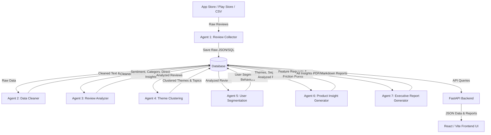
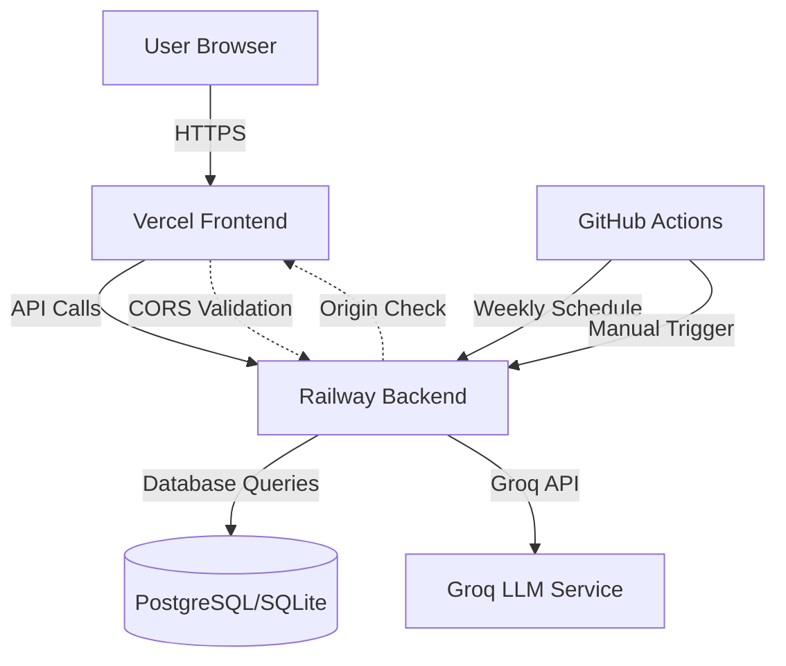

# Architecture: AI-Powered Review Discovery Engine

This document details the system architecture for the **AI-Powered Review Discovery Engine**, a multi-agent platform designed to ingest music app reviews and synthesize them into actionable user behavior and product discovery insights.

The entire system leverages **Groq LLM** (e.g., Llama-3-70b-8192, Llama-3-8b-8192) for high-speed, structured text processing, cleaning, categorization, clustering, and reporting.

---

## 1. System Overview & Data Flow

The platform operates as a multi-stage data processing pipeline driven by seven specialized AI agents. Below is the conceptual architecture showing how data flows from raw reviews to the final dashboard reports.



---

## 2. Core Questions Answered by the Engine

The system is configured to extract patterns addressing six core user research questions:
1. **Why do users struggle to discover new music?** (Mapped to Agent 3 & Agent 4)
2. **What are the biggest frustrations with music recommendations?** (Mapped to Agent 3 & Agent 6)
3. **What listening behaviors are users trying to achieve?** (Mapped to Agent 5)
4. **What causes users to repeatedly listen to the same songs?** (Mapped to Agent 5 & Agent 6)
5. **Which user segments experience different discovery challenges?** (Mapped to Agent 5)
6. **What unmet needs consistently emerge across reviews?** (Mapped to Agent 6 & Agent 7)

---

## 3. Phase-by-Phase Detailed Implementation Specs

---

### Phase 1: Data Ingestion

#### Objectives
Ingest, parse, validate, and store raw music app reviews from external sources (e.g., CSV dumps, Google Play Store, iOS App Store feeds) into a structured relational storage layer, preventing duplicate records and malformed inputs.

#### Inputs
- Local or uploaded CSV/JSON datasets containing review strings, user ratings, timestamps, and versions.
- Web scrapers targeting public App Store/Play Store review RSS feeds.

#### Outputs
- Standardized rows inserted into the `raw_reviews` database table.
- Detailed logs summarizing ingested rows, skipped rows, and processing duration.

#### Folder Structure
```
phase1_data_ingestion/
├── src/
│   ├── __init__.py
│   ├── ingestion.py          # Primary ingestion scripts and parser
│   ├── schema.py             # Pydantic schemas for data validation
│   └── utils.py              # File helpers and connection pooling
├── tests/
│   ├── __init__.py
│   └── test_ingestion.py     # Ingestion tests and parser checks
├── requirements.txt          # Python dependencies (pandas, pydantic, sqlalchemy)
└── README.md
```

#### API Flow
1. Client issues a `POST /api/pipeline/ingest` request with a CSV file multipart upload.
2. The endpoint reads the file stream and routes it to `ingestion.py`.
3. Validated rows are written in batches of 100 to the database.
4. Returns an HTTP 200 with an ingestion summary (e.g., `{"status": "success", "records_ingested": 1050}`).

#### Storage
- **Database Table**: `raw_reviews`
  - `id`: UUID (Primary Key)
  - `review_text`: Text (Required)
  - `rating`: Integer (1-5, Required)
  - `review_date`: Timestamp (Required)
  - `app_version`: String (Optional)
  - `platform`: String ('ios' | 'android', Required)
  - `ingested_at`: Timestamp (Default: NOW)
  - **Constraint**: Unique index on `(review_text, review_date, platform)` to avoid duplication.

#### Execution Flow
1. File uploaded -> Read contents into Pandas DataFrame.
2. Normalize column headers (e.g. mapping "content" or "body" to "review_text").
3. Map rows to `RawReviewSchema` (Pydantic).
4. Bulk insert records using SQLAlchemy Core core statement execution.

#### Error Handling
- **Malformed Rows**: Rows missing essential fields (`review_text`, `rating`) are skipped, tracked, and written to a rejected records log.
- **Database Write Failures**: Transactions are rolled back automatically if writing fails mid-batch.

#### Retry Mechanism
- External Scraper Network requests: tenacity-based retry (3 attempts, exponential backoff starting at 2s).

#### Logging
- Log warning message for skipped/malformed records.
- Log info on batch transactions: `[Ingestion] Ingested 100 records in 0.42s`.

#### Testing Strategy
- **Unit Tests**: Mock CSV files and verify Pydantic parser matches correctly.
- **Integration Tests**: Mock database session to check database constraint violation handling (e.g., inserting duplicates).

---

### Phase 2: Agent Analysis

#### Objectives
Clean raw text using Agent 2 (removing noise, standardized translation) and classify reviews with Agent 3 (sentiment, category, extraction of core discovery friction points) using Groq LLM API.

#### Inputs
- Unprocessed rows from `raw_reviews` database table.

#### Outputs
- Rows written to `cleaned_reviews` and `analyzed_reviews`.

#### Folder Structure
```
phase2_agent_analysis/
├── src/
│   ├── __init__.py
│   ├── cleaner.py            # Agent 2 - Cleaning Logic & Groq API
│   ├── analyzer.py           # Agent 3 - Classification & Groq API
│   ├── prompts.py            # Prompt templates for Llama-3 models
│   └── models.py             # Pydantic schemas representing Agent outputs
└── tests/
    ├── __init__.py
    ├── test_cleaner.py       # Mock Groq tests for Agent 2
    └── test_analyzer.py      # Mock Groq tests for Agent 3
```

#### API Flow
1. The Orchestration controller runs Phase 2.
2. Uncleaned records are loaded from the database.
3. For each review:
   - Call Agent 2 endpoint via Groq -> Write `cleaned_reviews`.
   - Call Agent 3 endpoint via Groq -> Write `analyzed_reviews`.

#### Storage
- **Database Table**: `cleaned_reviews`
  - `id`: UUID (Primary Key)
  - `raw_review_id`: UUID (Foreign Key -> `raw_reviews.id`)
  - `cleaned_text`: Text
  - `language`: String (e.g. 'en')
  - `is_spam`: Boolean
- **Database Table**: `analyzed_reviews`
  - `id`: UUID (Primary Key)
  - `cleaned_review_id`: UUID (Foreign Key -> `cleaned_reviews.id`)
  - `sentiment`: String ('positive' | 'neutral' | 'negative')
  - `category`: String ('recommendation' | 'ui' | 'search' | 'performance' | 'audio')
  - `discovery_friction_flag`: Boolean
  - `extracted_barriers`: JSONB/Text (array of specific music discovery obstacles found)

#### Execution Flow
1. Load batch of unprocessed reviews.
2. Execute Agent 2 (Cleaner) using `llama-3-8b-8192` to filter out spam and standardize language.
3. Execute Agent 3 (Analyzer) using `llama-3-8b-8192` with structural JSON constraints to evaluate sentiment and flag discovery barriers.
4. Update states in the database.

#### Error Handling
- **API Failures**: If Groq API rate limits (HTTP 429) or times out, defer the batch and update database queue.
- **Malformed LLM Output**: Catch JSON decoding errors when parsing Groq response. Re-request or skip record if fallback fails.

#### Retry Mechanism
- Enforce Groq API request retries using `tenacity` on rate limit (429) and server errors (5xx) up to 4 retries with randomized backoff.

#### Logging
- Output structured JSON logs: `{"timestamp": "...", "level": "INFO", "agent": "Agent 3", "review_id": "...", "sentiment": "negative"}`.
- Log token count and latency measurements for Groq.

#### Testing Strategy
- Use unit test suite with mock Groq API clients (`unittest.mock`) to inspect model parameters (temperature, max_tokens) and enforce schema parsers.

---

### Phase 3: Orchestration

#### Objectives
Coordinate pipeline execution, manage dependency resolution, maintain centralized state control, and record operational logs for visual dashboard reporting.

#### Inputs
- Manual API execution trigger or database scheduler state.

#### Outputs
- Finalized multi-agent run records and execution log trails.

#### Folder Structure
```
phase3_orchestration/
├── src/
│   ├── __init__.py
│   ├── orchestrator.py       # Core State Machine
│   ├── state_db.py           # Execution states schema
│   └── tasks.py              # Asynchronous execution helpers
└── tests/
    ├── __init__.py
    └── test_orchestrator.py  # Orchestrator transition tests
```

#### API Flow
1. Client calls `POST /api/pipeline/run` to launch pipeline asynchronously.
2. The orchestrator returns a `run_id` and registers the job.
3. Client polls `GET /api/pipeline/status?run_id=xxx` for status.

#### Scheduler Integration
The orchestrator includes an automated scheduler for weekly pipeline execution:

**Schedule Configuration:**
- **Frequency:** Weekly (every Monday)
- **Time:** 10:00 AM IST (Asia/Kolkata timezone)
- **Implementation:** APScheduler with BackgroundScheduler
- **Job ID:** `weekly_pipeline_execution`

**Scheduler Features:**
- Automatic review collection and analysis
- Frontend data synchronization after pipeline completion
- Comprehensive scheduler logging to database and file
- Event listeners for job execution tracking
- Graceful shutdown handling
- Manual execution support (`--mode run-now`)
- Status query support (`--mode status`)

**Scheduler Storage:**
- **Database Table:** `scheduler_logs`
  - `log_id`: UUID (Primary Key)
  - `job_name`: String
  - `status`: String ('pending' | 'running' | 'completed' | 'failed')
  - `executed_at`: Timestamp
  - `next_run_time`: Timestamp
  - `error_message`: Text
  - `timestamp`: Timestamp

**Scheduler Logging:**
- File-based logs in `logs/scheduler/scheduler_YYYYMMDD.log`
- Database logging via `SchedulerLog` model
- Event listeners for successful and failed job executions
- Next run time tracking

**Frontend Auto-Update:**
After pipeline completion, the scheduler automatically:
- Copies latest reports to `phase5_frontend_ui/public/data/`
- Updates executive report, themes, segments, insights, and analyzed reviews
- Creates `last_update.json` with timestamp
- Ensures frontend displays most recent data

#### Storage
- **Database Table**: `pipeline_runs`
  - `run_id`: UUID (Primary Key)
  - `status`: String ('pending' | 'running' | 'completed' | 'failed')
  - `current_phase`: String ('ingestion' | 'cleaning_analysis' | 'clustering' | 'segmentation' | 'reporting')
  - `start_time`: Timestamp
  - `end_time`: Timestamp
- **Database Table**: `agent_execution_logs`
  - `log_id`: UUID (Primary Key)
  - `run_id`: UUID (Foreign Key -> `pipeline_runs.run_id`)
  - `agent_name`: String
  - `log_level`: String
  - `message`: Text
  - `timestamp`: Timestamp

#### Execution Flow
1. Set status to `running`.
2. Run Phase 1 Ingestion. If empty, stop.
3. Run Phase 2 Cleaning & Analysis.
4. Run Agent 4 (Theme Clustering) and Agent 5 (User Segmentation) concurrently.
5. Run Agent 6 (Product Insight Generator) using the output of Agent 4 and Agent 5.
6. Run Agent 7 (Executive Report Generator).
7. Finalize status as `completed`.

#### Error Handling
- Catch exceptions from individual agents. Mark run as `failed` and populate `error_message` in the DB.
- Use atomic transactions to ensure partial failures do not leave database schemas out of sync.

#### Retry Mechanism
- Task-level retry: Orchestration step is retried once if a database deadlock or temporary network outage occurs.

#### Logging
- Trace log records inserted to `agent_execution_logs` DB table for UI rendering.

#### Testing Strategy
- Mock phases and verify the state transitions (e.g. `pending` -> `running` -> `failed` on mock error raise).

---

### Phase 4: Backend API

#### Objectives
Serve reviews, processed findings, user segments, theme clusters, and final executive summaries to the UI. Expose operations to trigger and cancel pipeline jobs.

#### Inputs
- Query parameters (sentiment, category, search phrase, limit, offset).

#### Outputs
- Standardized REST JSON responses.

#### Folder Structure
```
phase4_backend_api/
├── src/
│   ├── __init__.py
│   ├── main.py               # FastAPI App entrypoint
│   ├── config.py             # Settings (Database URL, Groq API keys)
│   ├── database.py           # Session engines
│   ├── routes/
│   │   ├── pipeline.py       # Pipeline triggers and status
│   │   ├── reviews.py        # Reviews search and filtering
│   │   └── insights.py       # Clusters, segments and reports
│   └── models/
│       └── response.py       # Unified API response models
└── tests/
    ├── __init__.py
    └── test_routes.py        # API endpoint validation tests
```

#### API Flow
- `GET /api/reviews` -> Retrieves analyzed reviews filterable by category and sentiment.
- `GET /api/insights/clusters` -> Gets list of clustered themes generated by Agent 4.
- `GET /api/insights/segments` -> Gets user segments generated by Agent 5.
- `GET /api/insights/report` -> Fetches the latest synthesized executive markdown report.

#### Storage
- Database connection pool (e.g., SQLAlchemy `NullPool` or `QueuePool`). No local file storage is required since everything resides in relational tables.

#### Execution Flow
1. FastAPI parses parameters.
2. Establish DB Session dependency.
3. Execute SQL query.
4. Parse ORM schema objects to Pydantic Response schemas.
5. Return JSON payload.

#### Error Handling
- Implement global middleware exception handler capturing internal server errors (500) and mapping database errors to standard API error schemas.

#### Retry Mechanism
- API DB Connection retry: automatic pool reconnect handling for disconnected database sockets.

#### Logging
- Access logging using FastAPI logs: `INFO: 127.0.0.1:52132 - "GET /api/reviews HTTP/1.1" 200 OK`.

#### Testing Strategy
- Use FastAPI `TestClient` to mock database connections and query all endpoints verifying correct validation outputs and HTTP status codes.

---

### Phase 5: Frontend UI (Next.js)

#### Objectives
Provide a premium, high-fidelity responsive user interface dashboard enabling users to trigger the analysis run, view live agent logs, browse reviews, interact with theme clusters, and read executive summaries using modern Next.js framework.

**CRITICAL ARCHITECTURAL CONSTRAINT**: The frontend must never directly access JSON files. All data must be consumed exclusively through backend API endpoints.

#### Inputs
- REST API queries only (no direct file access).

#### Outputs
- Interactive UI components, dashboard visualizations, and report export features.

#### Folder Structure
```
phase5_frontend_ui/
├── src/
│   ├── app/
│   │   ├── layout.tsx          # Root layout with navigation
│   │   ├── page.tsx            # Overview dashboard page
│   │   ├── themes/page.tsx     # Theme clusters page
│   │   ├── pain-points/page.tsx # Pain points page
│   │   ├── feature-requests/page.tsx # Feature requests page
│   │   ├── segments/page.tsx   # User segments page
│   │   ├── executive-summary/page.tsx # Executive report page
│   │   ├── search/page.tsx     # Search reviews page
│   │   ├── pipeline/page.tsx   # Pipeline status page
│   │   ├── globals.css         # Global styles with Tailwind
│   │   └── layout.tsx
│   ├── components/
│   │   ├── Navigation.tsx      # Main navigation component
│   │   └── MetricCard.tsx      # Reusable metric card component
│   └── lib/
│       ├── api.ts              # Centralized API client (NO direct JSON access)
│       └── utils.ts            # Utility functions
├── .env.local                  # API base URL configuration
├── .env.example                # Example environment variables
├── package.json                # Next.js dependencies
├── tsconfig.json               # TypeScript configuration
├── tailwind.config.ts         # Tailwind CSS configuration
├── postcss.config.js           # PostCSS configuration
└── next.config.js              # Next.js configuration
```

#### Dashboard Pages
1. **Overview** (`/`) - High-level metrics and system status
2. **Themes** (`/themes`) - Theme clusters from Agent 4
3. **Pain Points** (`/pain-points`) - User frustrations and barriers
4. **Feature Requests** (`/feature-requests`) - User-requested features
5. **User Segments** (`/segments`) - User behavior segments from Agent 5
6. **Executive Summary** (`/executive-summary`) - Comprehensive report from Agent 7
7. **Search Reviews** (`/search`) - Search and filter analyzed reviews
8. **Pipeline Status** (`/pipeline`) - Monitor and control pipeline execution

#### API Flow
1. Next.js server components fetch data from backend APIs on page load.
2. Client components use API client from `lib/api.ts` for interactive features.
3. All API calls go through the backend at the configured `NEXT_PUBLIC_API_BASE_URL`.
4. Event handlers call POST methods (e.g. click "Start Pipeline" runs `POST /api/pipeline/run`).
5. Set polling interval of 2 seconds while pipeline state is `running`.
6. **No direct JSON file imports or fetches from the frontend** - all data comes from backend APIs.

#### Storage
- Server-side data fetching with Next.js server components.
- Client-side state management with React hooks (`useState`, `useEffect`).
- Local Storage for persisting UI settings (e.g., user theme preference).
- **No local JSON file storage or access** - all data is fetched from backend.

#### Execution Flow
1. Next.js app initializes with layout and navigation.
2. Server components fetch initial data from backend APIs.
3. Render base dashboard structure with Tailwind CSS styling.
4. Client components handle interactive features (search, pipeline control).
5. Display loading states and error messages for failed API calls.

#### Error Handling
- React Error Boundaries wrap layout templates to catch component runtime errors.
- Display error messages when backend server is unreachable.
- API client implements automatic retry logic (3 attempts with exponential backoff).

#### Retry Mechanism
- Client-side fetch requests: automatically retry fetch requests up to 3 times on failed connections with exponential backoff (1s, 2s, 4s).
- Pipeline status polling continues until completion or failure.

#### Logging
- Output dev-mode console debug logs; omit in production build configurations.
- Log API errors for debugging backend connectivity issues.

#### Testing Strategy
- React Testing Library to test component renders, verify search input field triggers, and mock fetch calls to test loading and error alerts.
- Test API client with mocked backend responses to ensure no direct file access occurs.
- End-to-end testing with Playwright for critical user flows.

---

## 4. Production Deployment Architecture

### Deployment Platforms

**Frontend:** Next.js 14 deployed on Vercel
**Backend:** FastAPI deployed on Railway or Render
**Database:** SQLite (development) / PostgreSQL (production recommended)
**CI/CD:** GitHub Actions for automated weekly pipeline execution

### Deployment Configuration

#### Frontend (Vercel)
- **Framework:** Next.js 14 with TypeScript
- **Build Command:** `npm run build`
- **Output Directory:** `.next`
- **Environment Variables:**
  - `NEXT_PUBLIC_API_BASE_URL`: Backend API URL (Railway/Render)
- **Configuration File:** `vercel.json`
- **Automatic:** SSL, CDN, edge caching

#### Backend (Railway/Render)
- **Framework:** FastAPI with Uvicorn
- **Build Command:** `pip install -r requirements.txt`
- **Start Command:** `uvicorn src.main:app --host 0.0.0.0 --port $PORT`
- **Process File:** `Procfile`
- **Environment Variables:**
  - `GROQ_API_KEY`: Groq API key for LLM processing
  - `DB_CONN_STR`: Database connection string
  - `ALLOWED_ORIGINS`: Comma-separated list of allowed CORS origins (Vercel URL)
  - `SCHEDULE_TIME`: Scheduler time (10:00)
  - `SCHEDULE_DAY`: Scheduler day (mon)
  - `TIMEZONE`: Scheduler timezone (Asia/Kolkata)
  - Batch size configurations

#### CORS Configuration
- **Development:** Allows localhost origins
- **Production:** Restricts to specific Vercel domain(s)
- **Environment Variable:** `ALLOWED_ORIGINS`
- **Implementation:** FastAPI CORSMiddleware in `main.py`

#### GitHub Actions (CI/CD)
- **Schedule:** Weekly (Monday 10:00 AM IST / 4:30 AM UTC)
- **Trigger:** Cron schedule + manual workflow dispatch
- **Execution:** Full pipeline run with artifact uploads
- **Artifacts:** Pipeline results, executive reports, scheduler logs
- **Retention:** 30-90 days depending on artifact type
- **Configuration:** `.github/workflows/weekly-pipeline.yml`

### Production Architecture Diagram



### Environment Variable Flow

1. **Frontend (Vercel):**
   - `NEXT_PUBLIC_API_BASE_URL` → Backend URL
   - Used in `lib/api.ts` for all API calls

2. **Backend (Railway/Render):**
   - `GROQ_API_KEY` → Groq API authentication
   - `ALLOWED_ORIGINS` → CORS validation
   - `DB_CONN_STR` → Database connection
   - Scheduler configuration variables

3. **GitHub Actions:**
   - `GROQ_API_KEY` → From repository secrets
   - `BACKEND_URL` → Backend deployment URL
   - `FRONTEND_URL` → Frontend deployment URL

### Security Considerations

- **API Keys:** Stored in environment variables, never committed
- **CORS:** Restricted to specific production domains
- **HTTPS:** Automatic SSL on all platforms
- **Secrets:** GitHub Secrets for CI/CD
- **Database:** Consider PostgreSQL for production with connection pooling

### Scaling Strategy

- **Frontend:** Vercel automatically scales with edge network
- **Backend:** Upgrade Railway/Render instance based on load
- **Database:** Migrate to PostgreSQL for better performance
- **API Rate Limits:** Monitor Groq API usage, upgrade tier if needed

### Monitoring and Logging

- **Vercel:** Build logs, analytics, error tracking
- **Railway/Render:** Application logs, resource usage
- **GitHub Actions:** Workflow execution logs and summaries
- **Application:** Structured logging to database and files

### Deployment Documentation

- **Deployment Guide:** `DEPLOYMENT_GUIDE.md` - Step-by-step deployment instructions
- **Deployment Readiness:** `DEPLOYMENT_READINESS.md` - Pre-deployment checklist
- **GitHub Actions:** `.github/README.md` - CI/CD documentation
- **Environment Templates:** `.env.example` files in each phase

---

## 5. Multi-Agent System Detail (7 AI Agents)

Below are implementation parameters for each agent in the system:

| Agent Name | LLM Model | Temperature | Structured Schema Output |
| :--- | :--- | :--- | :--- |
| **1. Review Collector** | *N/A (Python)* | *N/A* | `RawReviewSchema` (Pydantic validation) |
| **2. Data Cleaner** | `llama-3-8b-8192` | 0.0 | `CleanedReviewSchema` (Text, Spam status, Lang) |
| **3. Review Analyzer** | `llama-3-8b-8192` | 0.1 | `AnalyzedReviewSchema` (Sentiment, Category, Barriers) |
| **4. Theme Clustering** | `llama-3-70b-8192` | 0.3 | `ThemeClusterSchema` (Theme title, supporting reviews) |
| **5. User Segmentation**| `llama-3-70b-8192` | 0.2 | `UserSegmentSchema` (Segment label, traits, challenges) |
| **6. Product Insight Gen**| `llama-3-70b-8192`| 0.5 | `InsightSchema` (Opportunity, Target, Impact) |
| **7. Executive Report Gen**| `llama-3-70b-8192`| 0.4 | Markdown string (Synthesized executive dashboard content) |
